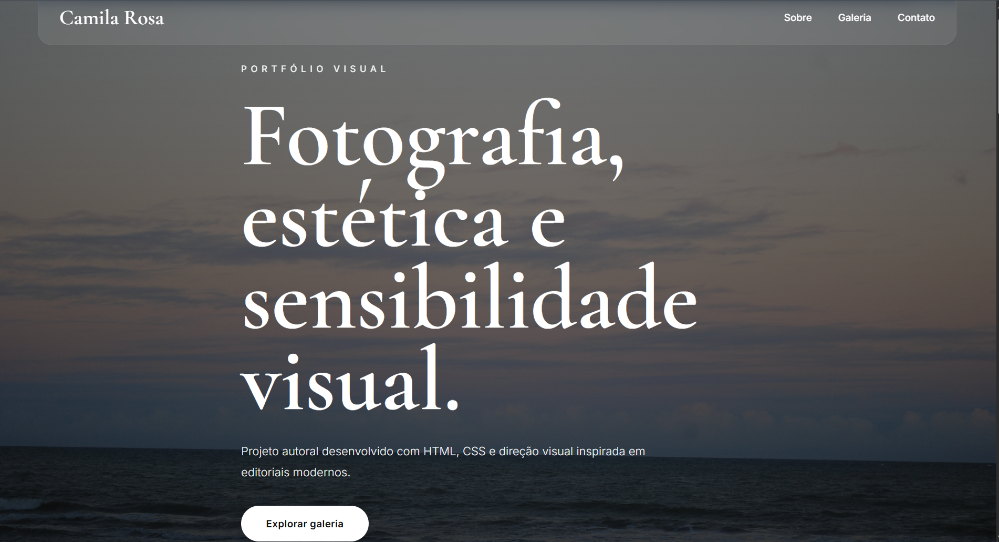

# Portfolio fotografia

Projeto autoral desenvolvido com HTML, CSS e JavaScript, explorando direção visual, fotografia e interfaces inspiradas em editoriais modernos.

## Tecnologias

- HTML5
- CSS3
- JavaScript
- GitHub Pages

## Objetivo

Criar uma experiência visual elegante e responsiva, unindo fotografia autoral e desenvolvimento front-end.

## Funcionalidades

- Layout responsivo
- Hero cinematográfico
- Galeria interativa
- Hover animations
- Navegação suave
- Design minimalista

## Preview



## Deploy

Acesse o projeto online:

```txt
https://camila-codes.github.io/portfolio-fotografia/
```
